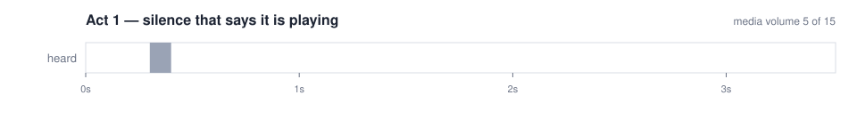
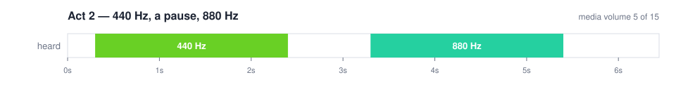
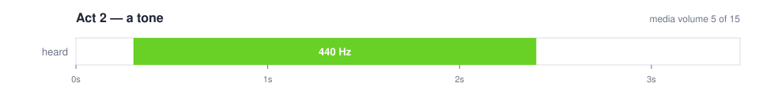
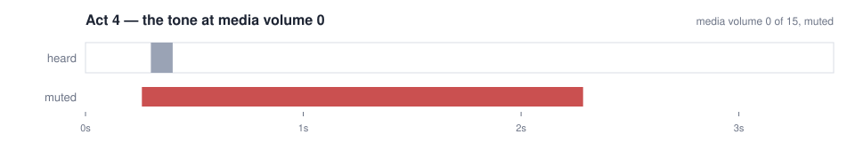
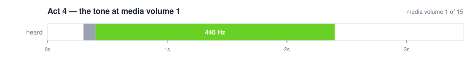
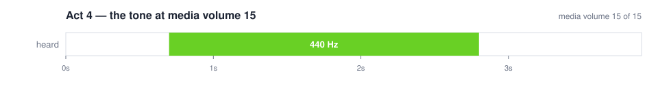
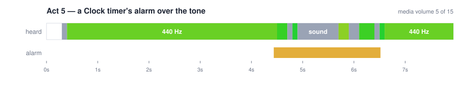
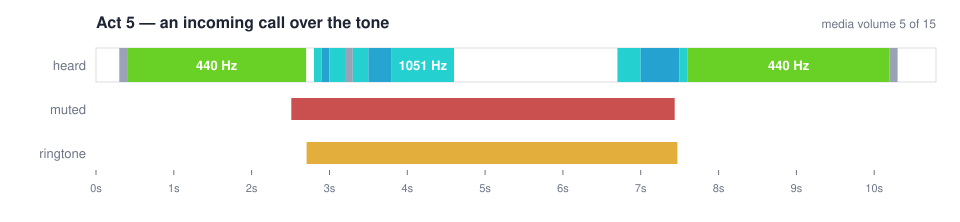
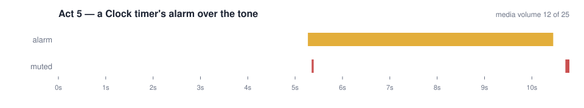

# Evidence

Every run behind this repository's numbers, generated by `scripts/summarize.py` from each run's
`summary.json` and each capture's own answer. Each run folder holds a transcript of every command
with what it printed, the WAVs, each stop's answer as JSON, a drawing of each, and the test reports.

## On an emulator: heard

| Run | Act 1: silence | Act 2: the sequence | Act 3: tests | Act 4: the tone by volume | Act 5: a call | Act 5: an alarm |
| --- | --- | --- | --- | --- | --- | --- |
| [2026-10-07-android-emulator](2026-10-07-android-emulator/transcript.md) | silence | 440 Hz for 2.1 s, then 880 Hz for 2.1 s | heard: 2 passed (17.3s); wrong: 0 passed, 2 failed (14.5s) | 15: -9.3 dBFS · 5: -41.8 dBFS · 1: -62.5 dBFS · 0: silence | heard 440 Hz at 0.9–3.2 s, 8.1–10.8 s, and 4 other sounds between; interrupted: muted for a call 3.0–8.0 s; a ringtone 3.3–8.0 s | heard 440 Hz at 0.4–4.5 s, 6.6–7.9 s, and 2 other sounds between; interrupted: an alarm 4.4–6.5 s |

## On phones and iOS

| Run | Device | What it recorded |
| --- | --- | --- |
| [2026-10-07-android-phone](2026-10-07-android-phone/transcript.md) | Pixel 8 Pro, Android 17 | an alarm over the tone — interrupted: an alarm 5.3–10.5 s; no sound, since a phone's is not captured |
| [2026-10-07-ios-simulator](2026-10-07-ios-simulator/transcript.md) | iPhone 17 Pro simulator, iOS 26.5 | refused: a simulator's audio is not captured yet — it plays through the Mac's own audio device for simulators, which Mobium does not read. Capture on an Android emulator |

## The drawings

### 2026-10-07-android-emulator

### 2026-10-07-android-phone

## Files

- **2026-10-07-android-emulator** (Pixel 7 emulator, Android 15): [transcript](2026-10-07-android-emulator/transcript.md), [heard report](2026-10-07-android-emulator/report-heard/index.html), [wrong report](2026-10-07-android-emulator/report-wrong/index.html), [summary](2026-10-07-android-emulator/summary.json), [act1-silence](2026-10-07-android-emulator/act1-silence.wav), [act2-sequence](2026-10-07-android-emulator/act2-sequence.wav), [act2-tone](2026-10-07-android-emulator/act2-tone.wav), [act4-volume-0](2026-10-07-android-emulator/act4-volume-0.wav), [act4-volume-1](2026-10-07-android-emulator/act4-volume-1.wav), [act4-volume-15](2026-10-07-android-emulator/act4-volume-15.wav), [act4-volume-5](2026-10-07-android-emulator/act4-volume-5.wav), [act5-alarm](2026-10-07-android-emulator/act5-alarm.wav), [act5-call](2026-10-07-android-emulator/act5-call.wav), [sequence](2026-10-07-android-emulator/sequence.wav), [silence](2026-10-07-android-emulator/silence.wav), [wrong-pitch](2026-10-07-android-emulator/wrong-pitch.wav), [wrong-silence](2026-10-07-android-emulator/wrong-silence.wav)
- **2026-10-07-android-phone** (Pixel 8 Pro, Android 17): [transcript](2026-10-07-android-phone/transcript.md), [summary](2026-10-07-android-phone/summary.json)
- **2026-10-07-ios-simulator** (iPhone 17 Pro simulator, iOS 26.5): [transcript](2026-10-07-ios-simulator/transcript.md), [summary](2026-10-07-ios-simulator/summary.json)
